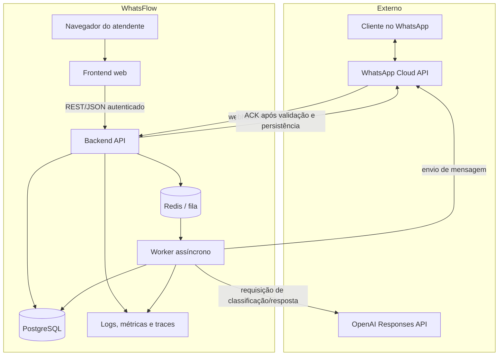
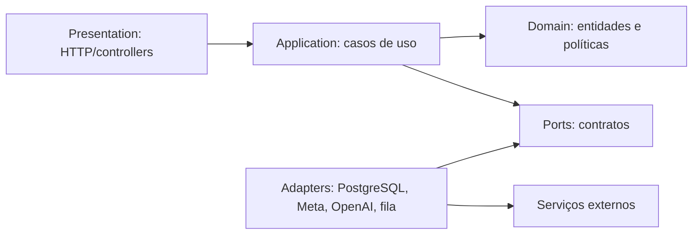
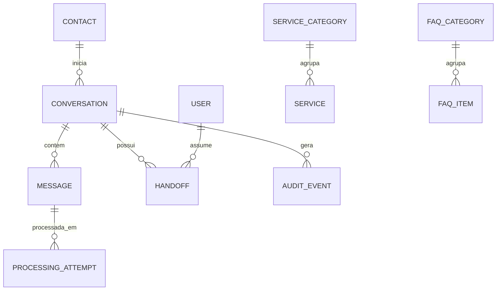

# Arquitetura do Sistema

## Índice

- [Estado da implementação — Sprint 1, Fase 2](#estado-da-implementação--sprint-1-fase-2)

1. [Objetivos arquiteturais](#objetivos-arquiteturais)
2. [Visão geral](#visão-geral)
3. [Fluxos de comunicação](#fluxos-de-comunicação)
4. [Componentes e responsabilidades](#componentes-e-responsabilidades)
5. [Módulos do backend](#módulos-do-backend)
6. [Dados e consistência](#dados-e-consistência)
7. [Integrações externas](#integrações-externas)
8. [Segurança e privacidade](#segurança-e-privacidade)
9. [Confiabilidade e observabilidade](#confiabilidade-e-observabilidade)
10. [Implantação e escalabilidade](#implantação-e-escalabilidade)
11. [Por que esta arquitetura](#por-que-esta-arquitetura)
12. [Referências técnicas](#referências-técnicas)
13. [Recomendações do Arquiteto](#recomendações-do-arquiteto)

## Estado da implementação — Sprint 1, Fase 2

Esta fase materializa apenas a fundação: workspace pnpm, React/Vite, Express, TypeScript, logging HTTP, health checks, Prisma e PostgreSQL em Docker Compose. A stack atual está na ADR-007. Os módulos, integrações e diagramas de atendimento abaixo descrevem o destino do MVP, não funcionalidades já disponíveis. Filas, worker, autenticação e regras de domínio serão criados nas etapas correspondentes.

O módulo Operations inicia com liveness (processo) e readiness (SELECT 1 por Prisma). A composição das dependências fica no bootstrap; a aplicação Express pode ser testada sem iniciar servidor ou banco. Prisma fica na infraestrutura do backend. Aliases serão resolvidos tanto em desenvolvimento quanto no JavaScript compilado.

## Objetivos arquiteturais

A arquitetura deve priorizar:

- recebimento confiável e idempotente de eventos;
- resposta rápida ao webhook, desacoplada do tempo da IA;
- fronteiras explícitas entre domínio e fornecedores externos;
- rastreabilidade de cada mensagem;
- intervenção humana segura;
- evolução sem distribuição prematura;
- possibilidade de escalar API e workers independentemente;
- proteção de dados pessoais e segredos.

## Visão geral

O MVP adotará um **monólito modular com processamento assíncrono**. “Monólito” significa uma única base de backend e uma unidade lógica de domínio, não um bloco sem organização. Cada módulo terá responsabilidade, interface e dependências controladas. API HTTP e worker poderão ser processos implantáveis separados usando os mesmos módulos de aplicação.

Há dois fluxos independentes:

1. **Canal de atendimento:** WhatsApp Cloud API → webhook do backend → fila/worker → OpenAI e banco → WhatsApp Cloud API.
2. **Canal administrativo:** navegador → frontend → API autenticada do backend → banco/fila.

O frontend não participa do recebimento de mensagens. Colocá-lo entre Meta e backend aumentaria latência, superfície de falha e exposição de credenciais sem benefício.

### Diagrama de contêineres

## Fluxos de comunicação

### Fluxo inbound: cliente para o WhatsFlow

1. O cliente envia uma mensagem no WhatsApp.
2. A Meta recebe a mensagem e envia um evento ao endpoint HTTPS do backend.
3. O backend valida o evento, calcula/localiza sua chave idempotente e persiste o recebimento em transação curta.
4. O backend agenda o processamento e devolve sucesso rapidamente, sem esperar pela IA.
5. Um worker consome o trabalho, localiza contato/conversa e executa classificação e política de resposta.
6. Quando elegível, o worker consulta conteúdo aprovado e chama a OpenAI.
7. O resultado estruturado é validado pelo backend. A aplicação, e não o modelo, decide se responde ou escala.
8. A mensagem outbound é registrada e enviada pela WhatsApp Cloud API.
9. Estados posteriores de entrega são recebidos por webhook e atualizados de forma idempotente.

### Fluxo administrativo

1. O atendente acessa o frontend pelo navegador e se autentica.
2. O frontend chama apenas a API interna autenticada; nunca chama Meta ou OpenAI diretamente.
3. A API autoriza a ação, consulta ou altera o estado no PostgreSQL e registra auditoria.
4. Ao enviar uma resposta, o backend registra a intenção de envio e delega a entrega ao worker.
5. Atualizações do painel podem começar com atualização periódica; tempo real por SSE/WebSocket é uma evolução condicionada à necessidade.

### Fluxo de dependências

O domínio não importa SDKs da Meta, OpenAI, ORM ou framework web. Casos de uso dependem de contratos internos; adaptadores implementam esses contratos. Na prática, esse nível de Clean Architecture será aplicado aos pontos de volatilidade, sem criar camadas artificiais para operações triviais.

## Componentes e responsabilidades

### Frontend web

**Responsabilidades**

- autenticação e sessão do usuário interno;
- apresentação de conversas, mensagens, estados e filas;
- formulários de FAQ, catálogo e ações do atendente;
- feedback de carregamento, erros e autorização;
- acessibilidade e comportamento responsivo.

**Não é responsável por** regras de escalonamento, validação definitiva de permissões, comunicação direta com provedores ou armazenamento do histórico como fonte de verdade.

**Dependências:** backend por HTTPS e mecanismo de identidade escolhido.

### Backend API

**Responsabilidades**

- endpoint de verificação e recepção do webhook;
- validação, autenticação, autorização e rate limiting das interfaces aplicáveis;
- orquestração dos casos de uso;
- transações e idempotência;
- API do painel;
- exposição de health checks e telemetria;
- enfileiramento de tarefas duráveis.

O endpoint de webhook não deve executar chamadas lentas à IA antes do ACK. Seu limite transacional é aceitar e registrar o evento com segurança.

### Worker assíncrono

**Responsabilidades**

- consumir tarefas com retentativas e backoff;
- serializar o processamento por conversa quando necessário;
- classificar mensagens e aplicar a política de automação;
- montar contexto mínimo e aprovado;
- chamar OpenAI e validar sua saída;
- registrar e enviar mensagens outbound;
- direcionar falhas permanentes para inspeção e escalonamento.

Workers devem ser idempotentes: uma nova execução não pode produzir resposta duplicada.

### PostgreSQL

É a fonte de verdade para contatos, conversas, mensagens, estados, catálogo, FAQ, auditoria e metadados operacionais. Restrições únicas e transações reforçam invariantes que não devem depender apenas do código.

O conteúdo completo de mensagens é dado potencialmente pessoal. Acesso, retenção, backup e exclusão devem refletir essa classificação.

### Redis e fila

Fornecem desacoplamento temporal, retentativas e controle de concorrência. Redis não é a fonte de verdade do negócio. Se a infraestrutura inicial não puder operar Redis com confiabilidade, uma fila baseada em PostgreSQL é alternativa aceitável; essa escolha deve ser validada antes da implementação.

### WhatsApp Cloud API

É o adaptador do canal. Entrega eventos via webhook e aceita requisições de envio. IDs, estados e erros externos devem ser traduzidos para conceitos internos, preservando o payload bruto apenas pelo período e acesso estritamente necessários para suporte.

### OpenAI

É um mecanismo substituível de interpretação e geração. O backend envia contexto limitado, instruções versionadas e conteúdo aprovado. O MVP prevê a Responses API e Structured Outputs para obter um contrato validável. O modelo não acessa o banco diretamente nem decide sozinho ações de negócio.

O histórico canônico permanece no PostgreSQL. Mesmo que recursos de estado do provedor sejam usados futuramente, eles não substituem auditoria e continuidade sob controle do WhatsFlow.

## Módulos do backend

| Módulo            | Responsabilidade                                        | Pode depender de                      |
| ----------------- | ------------------------------------------------------- | ------------------------------------- |
| Identity & Access | Usuários internos, papéis, sessões e autorização        | Auditoria                             |
| Contacts          | Identidade mínima do contato no canal                   | Persistência                          |
| Conversations     | Ciclo de vida, responsável, modo e invariantes          | Contacts, Messaging, Audit            |
| Messaging         | Mensagens inbound/outbound e estados de entrega         | Conversations, integrações por portas |
| Automation        | Classificação, política, contexto e decisão de resposta | Conversations, Knowledge, AI port     |
| Knowledge         | FAQ, catálogo, versões e ativação                       | Audit                                 |
| Handoff           | Regras e registro de escalonamento/assunção             | Conversations, Identity               |
| Webhooks          | Admissão e normalização de eventos externos             | Messaging, Queue port                 |
| Audit             | Eventos imutáveis de ações relevantes                   | Persistência                          |
| Operations        | Health, métricas, jobs com falha e diagnósticos         | Todos por eventos/telemetria          |

Dependências cíclicas são proibidas. Coordenação entre módulos ocorre por casos de uso ou eventos internos, não por acesso direto às tabelas de outro módulo.

## Dados e consistência

### Entidades conceituais

O diagrama é conceitual, não um esquema de banco final.

### Invariantes principais

- um evento externo só pode ser admitido uma vez por chave idempotente;
- uma mensagem outbound possui um identificador interno antes do envio;
- uma conversa em modo humano não recebe resposta automática;
- transições de estado inválidas devem ser rejeitadas no caso de uso;
- uma resposta automática deve referenciar a mensagem que a originou;
- alterações administrativas relevantes geram auditoria;
- estados de entrega não regridem por evento atrasado.

### Consistência e outbox

Persistir dados e publicar diretamente em uma fila são duas operações distintas. Para evitar que uma transação seja confirmada sem que o trabalho seja agendado, o desenho prevê o padrão **transactional outbox**: a mesma transação grava a mudança e um evento pendente; um publicador o entrega à fila com idempotência.

Não se promete “exactly once” ponta a ponta, pois redes e provedores podem repetir eventos. O sistema buscará processamento **at least once com efeitos idempotentes**.

## Integrações externas

### Contrato com a WhatsApp Cloud API

- segredos somente no backend/gerenciador de segredos;
- verificação do webhook e validações oficiais;
- timeouts curtos e retentativas apenas para erros transitórios;
- respeito a limites, políticas de janela e templates vigentes;
- armazenamento dos IDs externos para correlação;
- adaptador testado por contrato com payloads sanitizados.

### Contrato com a OpenAI

- Responses API por adaptador próprio;
- modelo, limites e timeout configuráveis;
- Structured Outputs para classificação/decisão em esquema estrito;
- recusa, saída incompleta, schema inválido, timeout e rate limit tratados como resultados esperados;
- envio somente do contexto necessário;
- instruções estáveis reenviadas por chamada quando o modo de estado exigir;
- sem tool/function calling para ações destrutivas no MVP;
- `safety_identifier` derivado de identificador não pessoal quando aplicável;
- retenção no provedor definida conscientemente; não assumir os padrões como política do produto.

A [documentação oficial da OpenAI sobre Responses API](https://developers.openai.com/api/docs/guides/migrate-to-responses) orienta o uso dessa API como direção atual e descreve opções de estado. A [documentação de Structured Outputs](https://developers.openai.com/api/docs/guides/structured-outputs) fundamenta o uso de esquema validável. A aplicação ainda deve tratar erros semânticos, pois conformidade de esquema não garante veracidade.

## Segurança e privacidade

### Controles mínimos

- TLS em trânsito e criptografia gerenciada em repouso;
- credenciais fora do repositório e rotação documentada;
- menor privilégio para banco, fila, provedores e usuários internos;
- autenticação forte e autorização server-side por papel;
- proteção contra abuso nos endpoints públicos;
- validação de entrada, limite de payload e serialização segura;
- prevenção de XSS no painel e política de conteúdo apropriada;
- logs sem tokens, segredos ou conteúdo integral de conversa por padrão;
- auditoria de leitura/exportação quando o risco justificar;
- política de retenção, anonimização e atendimento a solicitações do titular;
- revisão de operadores e suboperadores sob a LGPD.

### Segurança da IA

Mensagens de clientes são dados não confiáveis e podem conter prompt injection. Elas nunca se tornam instruções de sistema. O modelo recebe políticas fixas, contexto delimitado e somente ferramentas permitidas. A decisão final de responder, escalar ou executar uma ação é validada pela aplicação.

A [orientação oficial de segurança da OpenAI](https://developers.openai.com/api/docs/guides/safety-best-practices) recomenda moderação quando aplicável, testes adversariais, limites de entrada/saída e supervisão humana. Esses itens entram no plano de testes e operação do MVP.

## Confiabilidade e observabilidade

### Estratégia de falhas

| Falha                               | Tratamento                                                            |
| ----------------------------------- | --------------------------------------------------------------------- |
| Webhook malformado/não autêntico    | Rejeitar, registrar metadados seguros e alertar por volume anormal.   |
| Evento duplicado                    | Retornar sucesso sem repetir efeitos.                                 |
| Banco indisponível                  | Não confirmar admissão; permitir reentrega do provedor.               |
| Fila indisponível após persistência | Outbox mantém evento pendente para publicação posterior.              |
| OpenAI com timeout/rate limit       | Retentativa limitada com backoff; depois fallback e/ou handoff.       |
| Saída inválida ou recusa            | Não enviar conteúdo bruto; aplicar fallback seguro.                   |
| Meta indisponível                   | Retentar envio conforme classe de erro e manter estado visível.       |
| Job excede tentativas               | Encaminhar a dead-letter lógica, alertar e deixar conversa acionável. |

### Telemetria

Cada evento deve ser correlacionável por `correlation_id`, `conversation_id`, `message_id` e IDs externos quando seguros. Métricas mínimas:

- volume e latência de webhooks;
- profundidade/idade da fila;
- duração e erros por etapa;
- chamadas, tokens/custo estimado e falhas de IA;
- envios e falhas da Meta;
- escalonamentos, tempo de espera e conversas paradas;
- jobs esgotados e eventos de outbox pendentes.

Alertas devem refletir impacto no usuário, evitando notificação para qualquer erro isolado recuperável.

## Implantação e escalabilidade

### Topologia inicial

- frontend implantado como aplicação web;
- backend API sem estado local, com uma ou mais réplicas;
- worker como processo separado, escalável pela fila;
- PostgreSQL gerenciado com backup;
- Redis gerenciado quando adotado;
- gerenciador de segredos e solução de observabilidade.

### Caminho de evolução

1. escalar réplicas de API e worker;
2. ajustar índices, pool de conexões, cache e concorrência por conversa;
3. particionar trabalho assíncrono por prioridade;
4. somente então considerar extração de um módulo com gargalo ou necessidade de isolamento comprovada.

Multitenancy futura exige `tenant_id` nas fronteiras e testes de isolamento, mas o MVP não deve adicionar complexidade operacional completa de tenant sem necessidade.

## Por que esta arquitetura

### Alternativas consideradas

| Alternativa                                | Benefício                             | Motivo para não escolher agora                                        |
| ------------------------------------------ | ------------------------------------- | --------------------------------------------------------------------- |
| Backend síncrono até a resposta da IA      | Implementação conceitualmente simples | Acopla ACK a dependências lentas e aumenta reentregas/timeouts.       |
| Microsserviços desde o início              | Escala e implantação isoladas         | Custo operacional e consistência distribuída desproporcionais ao MVP. |
| Frontend chamando OpenAI/Meta              | Menos endpoints internos              | Expõe credenciais, duplica regras e impede auditoria central.         |
| Histórico mantido apenas no provedor de IA | Menos persistência local              | Cria lock-in e não atende fonte de verdade/auditoria do produto.      |
| Geração livre sem esquema                  | Flexibilidade                         | Difícil de validar e perigosa para decisões de escalonamento.         |

O monólito modular combina simplicidade operacional com separação de responsabilidades. A fila isola o caminho crítico de entrada. Portas e adaptadores concentram volatilidade externa. PostgreSQL sustenta invariantes e auditoria. O desenho permite crescimento por medição, não por antecipação.

## Referências técnicas

- [OpenAI — Migração e direção da Responses API](https://developers.openai.com/api/docs/guides/migrate-to-responses)
- [OpenAI — Structured Outputs](https://developers.openai.com/api/docs/guides/structured-outputs)
- [OpenAI — Práticas recomendadas de segurança](https://developers.openai.com/api/docs/guides/safety-best-practices)
- Documentação oficial da WhatsApp Cloud API deve ser revisitada na Sprint 2 para confirmar contratos, versões, autenticação, políticas de envio e limites vigentes.

## Recomendações do Arquiteto

- Produzir, na Sprint 2, um diagrama de implantação referente ao provedor escolhido e um threat model dos fluxos públicos.
- Validar Redis/BullMQ versus fila transacional em PostgreSQL com base no ambiente de hospedagem; manter a porta de fila independente da escolha.
- Definir SLOs somente após teste de carga e baseline, mas instrumentar as métricas antes do piloto.
- Manter o modelo de IA configurável e selecionar uma versão por avaliação; não codificar um nome de modelo em regras de domínio.
- Criar testes de contrato com exemplos reais e sanitizados de webhooks antes de liberar o endpoint público.
