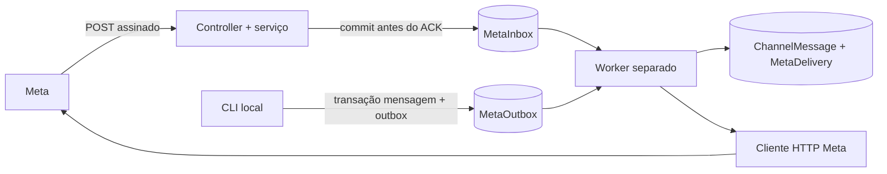

# Meta Cloud API — Sprint 2, Fase 4

## Índice

- [Estado e pré-requisitos](#estado-e-pré-requisitos)
- [Implementação da Fase 4](#implementação-da-fase-4)
- [Ambiente e execução](#ambiente-e-execução)
- [Validação local e envio manual](#validação-local-e-envio-manual)
- [Cadastro do webhook e validação ponta a ponta](#cadastro-do-webhook-e-validação-ponta-a-ponta)
- [Inconsistências registradas](#inconsistências-registradas)
- [Checkpoint 1 — recursos Meta](#checkpoint-1--recursos-meta)
- [Retomada e próximos checkpoints](#retomada-e-próximos-checkpoints)
- [Referências](#referências)
- [Recomendações do Arquiteto](#recomendações-do-arquiteto)

## Estado e pré-requisitos

Em 2026-09-29, o [review da Sprint 1](reviews/sprint-01-review.md) registra a aprovação da Fase 3 e a conclusão da fundação. O levantamento inicial encontrou somente infraestrutura; a implementação descrita abaixo foi autorizada em 2026-09-30.

**Sprint 2 concluída em 2026-10-02.** O responsável confirmou o aplicativo `WFlow Desenvolvimento`, credenciais e IDs da integração. O número brasileiro da Claro foi ativado/cadastrado; primeiro houve troca pelos recursos da Meta e depois validação ponta a ponta pelo WhatsFlow.

O número de teste internacional +1 falhou anteriormente com `130497`; esse caso fica preservado apenas como histórico/troubleshooting de restrição entre países e não representa o número brasileiro. O aceite real confirmou: callback verificado, app associado à WABA, campo `messages`, POST assinado, inbox `done`, inbound `received`, deduplicação, outbox `done`, HTTP 200 da Meta, Provider ID, recibos `sent`/`delivered` e mensagem no aparelho. `read` não foi recebido e não é requisito. Nenhuma credencial foi registrada no repositório ou relatório. ADR-009 registra o canal; [review final](reviews/sprint-02-review.md) registra as evidências.

## Implementação da Fase 4



- `GET /webhooks/meta`: valida `hub.mode=subscribe`, token e challenge numérico; retorna challenge como texto com HTTP 200. Token incorreto retorna 403; parâmetros inválidos retornam 400.
- `POST /webhooks/meta`: exige JSON, corpo até 1 MiB, sem compressão; verifica HMAC-SHA256 nos bytes originais com App Secret e comparação constante. Assinatura inválida retorna 401. WABA/número diferentes da configuração retornam 403. JSON/schema inválido retorna 400, mídia HTTP incompatível 415 e excesso de tamanho 413.
- O ACK 200 só ocorre após persistência da inbox. Falha de banco retorna 500, permitindo reentrega. Envelope idêntico é deduplicado por hash; mensagens reagrupadas em outro envelope são deduplicadas por número remetente + ID da Meta.
- Campos desconhecidos são preservados no envelope. Mudanças de campo diferente de `messages` são arquivadas sem efeito. Texto e metadados de outros tipos são persistidos sem interpretação ou download de mídia. Recibos suportados: `sent`, `delivered`, `read`, `failed`.
- Worker reserva eventos com SKIP LOCKED e lease de 60 segundos. Projeção de mensagens/recibos e conclusão da inbox compartilham transação. Eventos com falha são retentados até cinco tentativas; depois ficam `dead`.
- CLI cria mensagem outbound e outbox atomicamente. UUID `requestId` repetido com mesmo conteúdo reutiliza a intenção; conteúdo/destino diferente com o mesmo UUID gera conflito. Worker separado envia texto ou template simples sem parâmetros; não há campanhas nem geração de respostas.
- POST de envio usa bearer, versão/base configuráveis, timeout e bloqueio de redirecionamento. Retorna `accepted` ao obter ID da Meta. Os recibos depois confirmam envio/entrega/falha. Ranking: `accepted < sent < failed < delivered < read`; falha atrasada não apaga prova de entrega/leitura. Todos os recibos são mantidos separadamente.
- Rejeição explícita por rate limit permite até cinco tentativas com backoff e Retry-After. Falhas permanentes, incluindo restrição regional, não são repetidas. Rede, timeout, 5xx ou crash durante envio são ambíguos: estado `uncertain`, sem retry automático. `biz_opaque_callback_data` transporta o UUID interno e pode reconciliar um envio incerto. Não existe garantia exactly-once no provedor.
- Não há autenticação de painel nesta fase; por isso não foi exposto endpoint de envio. A CLI exige acesso ao ambiente/banco. Logs registram eventos técnicos, duração, códigos e IDs internos; omitem corpo, telefone, bearer, App Secret e query do challenge.

## Ambiente e execução

Todos os valores privados ficam no `.env` da raiz, ignorado por Git e Docker build. Não colar credenciais no chat. `.env.example` documenta:

| Variável                  | Uso                                                             |
| ------------------------- | --------------------------------------------------------------- |
| `META_ENABLED`            | `false` por padrão; `true` exige configuração completa          |
| `META_APP_SECRET`         | Autenticar assinatura dos POSTs; mínimo 16 caracteres           |
| `META_VERIFY_TOKEN`       | Segredo escolhido por você para o GET; mínimo 32 caracteres     |
| `META_ACCESS_TOKEN`       | Credencial de envio; conferir permissões e expiração no painel  |
| `META_PHONE_NUMBER_ID`    | ID do número remetente, não o telefone nem App ID               |
| `META_WABA_ID`            | ID da conta WhatsApp; corresponde a `entry[].id`                |
| `META_API_BASE_URL`       | `https://graph.facebook.com`; HTTPS e host oficial obrigatórios |
| `META_API_VERSION`        | Versão ativa exibida no painel, formato `vNN.0`; sem default    |
| `META_REQUEST_TIMEOUT_MS` | Padrão 10000; entre 100 e 30000                                 |
| `META_WORKER_POLL_MS`     | Padrão 1000; entre 100 e 60000                                  |

App ID é útil no suporte, mas não é necessário no contrato implementado. Não reutilizar App Secret como verify token. Se a credencial for temporária, renovar antes dos testes reais; validade não é comprovada pela simples presença no arquivo.

Modo local, com Node 24 e pnpm 10.34.5:

```bash
pnpm install --frozen-lockfile
docker compose up -d --wait postgres
pnpm db:generate
pnpm db:deploy
pnpm dev
```

Após habilitar Meta, em outro terminal: `pnpm worker`. Para Docker completo:

```bash
docker compose --profile meta config --quiet
docker compose --profile meta up --build -d --wait --wait-timeout 180
docker compose ps --all
docker compose logs --tail 50 worker
```

O serviço worker usa perfil `meta`, sem porta HTTP e sem health check fictício. Falha de bootstrap deve ser verificada pelo estado do contêiner/logs; health do backend não prova saúde do worker. Alterações de credenciais exigem recriar os serviços, e alterações do worker compilado exigem rebuild. Pare o worker com `docker compose --profile meta stop worker` antes de trocar o número remetente.

## Validação local e envio manual

```bash
pnpm check
pnpm db:validate
```

Os testes padrão usam HTTP local e cliente Meta mockado, sem chamadas reais. Para integração transacional, forneça `TEST_DATABASE_URL` em um ambiente privado e execute `pnpm test:integration`. O teste cria e remove somente seu próprio schema aleatório `whatsflow_test_*`. Pelo Docker já iniciado, sem imprimir credenciais:

```bash
docker compose exec -T backend sh -c 'TEST_DATABASE_URL="$DATABASE_URL" pnpm test:integration'
docker compose exec -T backend pnpm db:status
docker compose exec -T backend pnpm --filter @whatsflow/backend exec prisma migrate diff --from-config-datasource --to-schema prisma/schema.prisma --exit-code
```

Para envio manual, crie fora do repositório um JSON privado com UUID único e destinatário autorizado (código do país + DDD + número, somente dígitos). Exemplo sintético, que precisa ser substituído:

```json
{
  "requestId": "11111111-1111-4111-8111-111111111111",
  "to": "5500000000000",
  "message": {
    "type": "text",
    "text": { "body": "Teste manual do WhatsFlow" }
  }
}
```

Envie primeiro uma mensagem do aparelho ao número da API para iniciar o teste de resposta dentro da janela permitida pela Meta. Para template, substitua `message` por `{"type":"template","template":{"name":"NOME_APROVADO","language":{"code":"pt_BR"}}}` usando nome/idioma realmente disponíveis na WABA. O exemplo `hello_world/en_US` só deve ser usado quando existir no ambiente. A aplicação não consulta elegibilidade/janela; rejeições da Meta são registradas.

```bash
pnpm meta enqueue /caminho/privado/mensagem.json
pnpm meta status 11111111-1111-4111-8111-111111111111
```

Com worker ativo, enqueue autoriza envio real. Reutilize o UUID somente para a mesma intenção; criar outro UUID pode enviar outra mensagem. Timeout incerto exige conferência de recibos antes de qualquer nova intenção. Pelo Docker:

```bash
docker compose exec -T backend sh -c 'umask 077; mkdir -p /tmp/whatsflow-private'
docker compose cp /caminho/privado/mensagem.json backend:/tmp/whatsflow-private/mensagem.json
docker compose exec -T backend pnpm meta enqueue /tmp/whatsflow-private/mensagem.json
docker compose exec -T backend pnpm meta status 11111111-1111-4111-8111-111111111111
```

Remova o arquivo privado após seu teste, quando não precisar mais dele. A CLI imprime somente ID/estado e diagnóstico genérico em erro. Não exponha uma rota pública para substituir a CLI.

## Cadastro do webhook e validação ponta a ponta

O cadastro do número Claro e o checkpoint externo foram concluídos. Para repetir a validação em outro ambiente, use credenciais no `.env` privado, servidor ativo e URL HTTPS sob seu controle:

1. Configure o encaminhamento HTTPS para a porta do backend. Encaminhe apenas `/webhooks/meta`; não publique banco ou ferramentas administrativas. O mecanismo de túnel/hospedagem ainda precisa ser escolhido pelo responsável.
2. No caso de uso WhatsApp do aplicativo, localize a configuração de webhooks disponível na sua interface. Callback URL: `https://SEU_HOST/webhooks/meta`. Verify Token: exatamente o valor privado de `META_VERIFY_TOKEN`.
3. Acione a verificação/salvamento e confirme o sucesso no painel e o log `meta_webhook_verified`. Assine o campo `messages` da WABA para receber mensagens e estados. Confira também a associação do aplicativo à WABA; GET aprovado não comprova assinatura de eventos.
4. Envie mensagem do aparelho ao número da API. Confirme `meta_webhook_received`, `meta_message_received` e registro inbound no banco. Reentrega não deve criar outra mensagem.
5. Enfileire resposta autorizada. Confirme `accepted`, recibo `delivered`/`read` e mensagem visível no aparelho. HTTP 200 isolado não é aceite final.

O responsável já confirmou ativação do eSIM, cadastro do número e troca de mensagens pela plataforma Meta. Ainda é necessário colocar no `.env` privado os valores correspondentes ao número atual (`META_PHONE_NUMBER_ID`, `META_WABA_ID`, token/permissões e App Secret) e conferir a assinatura na WABA correta. A Atlas Tech é somente empresa demonstrativa e não deve ser cadastrada como pessoa jurídica real na Meta.

Pare os processos antes de trocar credenciais. As mensagens/outbox guardam o Phone Number ID original; o worker só consome envios do número configurado, evitando transmitir intenções antigas pelo número novo. Pendências do número anterior requerem inspeção, não remapeamento automático. O webhook admite apenas uma WABA/número por execução nesta fase; notificações do número antigo após a troca serão rejeitadas e não atualizam mais esses envios.

O fechamento da Sprint obteve evidências reais **passando pelo WhatsFlow com o número Claro**, sem capturas de tokens nem conteúdo pessoal de terceiros.

No aceite foi usado Cloudflare Quick Tunnel temporário. O aplicativo precisou ser associado explicitamente à WABA com `POST /{WABA-ID}/subscribed_apps`; assinar apenas o campo `messages` no painel não produziu o inbound. O Docker deste ambiente também não resolveu `graph.facebook.com`; o worker de aceite executou temporariamente com rede do host e acesso direto ao PostgreSQL. Essas limitações não alteram a arquitetura e devem ser resolvidas na infraestrutura do deploy, não por chamada externa espalhada no código.

## Inconsistências registradas

1. README, arquitetura e roadmap ainda apresentam a Fase 2 como marco principal da entrega, enquanto o review já encerra a Fase 3. A base implementada continua sendo a infraestrutura da Fase 2; a auditoria posterior não adicionou funcionalidades. Os documentos devem distinguir entrega técnica de aprovação da auditoria na atualização da Sprint 2.
2. A tabela de dependências da arquitetura lista `Conversations → Messaging` e `Messaging → Conversations`, mas proíbe ciclos. Essa ambiguidade deve ser resolvida antes de implementar módulos relacionados; nenhuma dependência circular foi criada na base atual.
3. O roadmap da Sprint 2 prevê componentes além da Fase 4 solicitada. A presente fase autoriza exclusivamente comunicação e persistência técnica, sem regras de negócio ou IA. Itens adicionais não serão implementados automaticamente.
4. A arquitetura prevê outbox e processamento assíncrono, ainda ausentes por serem posteriores à fundação. A integração não pode substituir esse contrato por processamento síncrono completo no webhook sem justificativa e registro prévios. A estratégia concreta deve ser detalhada antes da persistência/envio.

Esses pontos não invalidam a infraestrutura aprovada, mas impedem tratar o planejamento futuro como um contrato sem ambiguidades.

Tratamento em 2026-09-30: README/roadmap/arquitetura atualizados; ciclo documental removido; escopo restrito ao canal; alternativa PostgreSQL concretizada na ADR-009. A lista acima preserva o levantamento inicial.

## Checkpoint 1 — recursos Meta

Esta etapa depende da conta, permissões, aceite de termos e verificações do desenvolvedor. Se os recursos já existirem, confirme-os; não crie duplicatas.

Os nomes das telas podem variar conforme idioma e fluxo de onboarding. O guia principal da Meta retornou HTTP 429 durante a consulta; portanto, os caminhos abaixo são orientativos e devem ser conferidos no painel autenticado. Se o fluxo divergir, informe os nomes das opções disponíveis, sem revelar credenciais.

### Primeiro acesso — sem nenhuma configuração

Não pressupor que exista um menu **Meus aplicativos**: o desenvolvedor informou que ele não aparece. Login, cadastro de desenvolvedor e criação do aplicativo são etapas diferentes.

1. Abra o [acesso direto à criação de aplicativo](https://developers.facebook.com/apps/creation/) no navegador. Na consulta não autenticada de 2026-09-29, esse endereço redirecionou para login da Meta Business. Isso não comprova qual tela aparecerá depois de entrar na conta.
2. Se aparecer login, entre com sua própria conta Facebook. Se não possuir uma, conclua o cadastro legítimo pelo fluxo apresentado. Não crie uma conta pessoal fictícia em nome de WhatsFlow. Não compartilhe senha nem códigos de verificação.
3. Se aparecer cadastro **Meta for Developers**, **Começar / Get started** ou **Registrar**, conclua as etapas efetivamente apresentadas: aceite os termos após lê-los e forneça contato/verificações quando solicitados. Não é necessário localizar um menu chamado Meus aplicativos para realizar esse cadastro.
4. Se aparecer um formulário de criação de aplicativo, o acesso inicial já está resolvido. Preencha nome `WhatsFlow Desenvolvimento` e seu e-mail de contato real, se esses campos forem solicitados. Na seleção de finalidade, procure a opção que mencione explicitamente WhatsApp e mensagens empresariais. Se ela não existir, pare e informe as opções exibidas; não selecione outro produto por tentativa.
5. Se aparecer uma página institucional, erro, exigência de verificação ou uma tela diferente, interrompa a navegação e envie o título da página e os botões disponíveis, ou uma captura com dados pessoais ocultos. Não repetir instruções de menus que não foram observados.

**Validação deste primeiro passo:** conseguir visualizar o formulário de criação do aplicativo ou identificar precisamente qual cadastro/verificação bloqueia o acesso. Antes de orientar as telas seguintes, confirmar esse resultado com o desenvolvedor.

O restante deste checklist é uma referência para depois desse primeiro acesso, não uma afirmação de que tais menus já estão disponíveis. A documentação de cadastro retornou HTTP 429 nesta nova consulta; a interface autenticada não foi inspecionada.

### Após confirmar o acesso à criação do aplicativo

1. Conclua a seleção do caso de uso WhatsApp conforme as opções efetivamente disponíveis no painel.
2. Selecione um portfólio empresarial que você administra ou conclua sua criação conforme solicitado. Use informações legítimas do responsável. A empresa fictícia do produto é um cenário de demonstração, não uma identidade jurídica para verificações da Meta.
3. No aplicativo, abra a configuração do WhatsApp, normalmente **WhatsApp → Configuração da API / API Setup**, ou a área de testes equivalente. Para desenvolvimento, prefira o número de teste fornecido pela Meta. Não migre nem exclua sua conta pessoal de WhatsApp.
4. Na seleção de destinatários de teste, adicione um número seu, com código do país e DDD, e conclua a verificação solicitada. Use somente um destinatário autorizado.
5. Guarde com segurança o **App ID**, o **WhatsApp Business Account ID (WABA ID)** e o **Phone Number ID** exibidos. São identificadores distintos; Phone Number ID não é o número de telefone.
6. Gere o token de acesso de desenvolvimento no painel e anote a expiração informada. Confira as permissões de WhatsApp exigidas pelo fluxo, incluindo `whatsapp_business_messaging` para mensagens. Não trate o token temporário como credencial de produção.
7. Em **Configurações do aplicativo → Básico**, localize o **App Secret**. Guarde-o privadamente: será necessário para autenticar os eventos recebidos. Não confunda App Secret, token de acesso e verify token.
8. Gere um verify token próprio no terminal, se OpenSSL estiver disponível:

   ```bash
   openssl rand -hex 32
   ```

   Guarde o resultado em um gerenciador de segredos. Ele será configurado no servidor e no cadastro do webhook em uma etapa posterior. Não publique a saída do comando.

9. Se o painel oferecer envio de mensagem de teste, selecione seu destinatário verificado e utilize o exemplo fornecido pela Meta. Confirme o recebimento no aparelho. Esse teste valida a configuração Meta, **não** o envio pelo WhatsFlow.

Não envie token, App Secret, verify token, arquivo `.env` ou capturas sem censura pelo chat. Nenhum segredo deve entrar no Git ou em variáveis `VITE_*`. Os nomes definitivos das variáveis serão documentados junto à implementação, em `.env.example`, README e neste documento.

## Retomada e próximos checkpoints

Nota de atualização: a exigência de aguardar todos os itens abaixo antes de programar foi flexibilizada explicitamente pelo responsável em 2026-09-30. Os passos originais ficam como histórico/checklist externo. Número Claro e troca direta pela Meta foram confirmados em 2026-10-01; credenciais, callback, WABA e fluxo ponta a ponta pelo WhatsFlow foram validados em 2026-10-02.

Os recursos externos já confirmados são: aplicativo com WhatsApp ativo, portfólio/WABA disponíveis, número brasileiro cadastrado, IDs disponíveis, token de acesso e App Secret guardados e teste direto pela Meta funcionando. Os segredos devem ser preenchidos apenas no `.env` privado local, nunca transmitidos por chat ou versionados. O verify token pode ser gerado localmente no próximo checkpoint.

Os endpoints e testes locais já estão implementados. O GET de verificação e a autenticação dos POSTs têm finalidades distintas: verify token para o challenge; assinatura com App Secret para autenticidade dos eventos. A implementação preserva os bytes originais do POST para validar `X-Hub-Signature-256` antes de interpretar o JSON.

**Checkpoint 2 — concluído:** URL HTTPS temporária e verify token cadastrados; challenge confirmado por `meta_webhook_verified`; campo `messages` assinado.

**Checkpoint 3 — concluído:** app associado à WABA, recebimento e envio reais confirmados com destinatário autorizado; logs, banco, testes e documentação verificados.

## Referências

- [Coleção oficial da Meta — WhatsApp Cloud API](https://www.postman.com/meta/whatsapp-business-platform/documentation/wlk6lh4/whatsapp-cloud-api): recursos necessários e exemplos da API.
- [Guia oficial de início](https://developers.facebook.com/docs/whatsapp/cloud-api/get-started): acesso retornou HTTP 429 nesta consulta; conferir pelo navegador autenticado.
- [Referência histórica oficial sobre verificação de webhooks](https://whatsapp.github.io/WhatsApp-Nodejs-SDK/api-reference/webhooks/start/): distingue challenge e assinatura. O SDK está arquivado e não será adotado; contratos atuais deverão ser reconfirmados antes da implementação.

## Recomendações do Arquiteto

- Antes da demonstração controlada, definir retenção/expurgo da inbox bruta e mensagens. Payload contém dados pessoais; não publicar banco nem realizar exportações indiscriminadas. Não há expurgo automático nesta fase.
- Acrescentar métricas de idade da fila, supervisão do worker e fluxo administrativo de inspeção de `dead`/`uncertain` antes da operação com clientes. Não existe retry manual automatizado nesta entrega.
- Preservar payloads reais somente pelo período necessário e convertê-los em fixtures sanitizadas antes de qualquer versionamento.
- Planejar rotação de credenciais e acesso de produção em momento próprio. O número brasileiro atual atende à demonstração; isso não transforma a Atlas Tech em entidade jurídica nem o projeto em SaaS.
- Não expor uma rota pública de envio sem autenticação apenas para facilitar testes manuais.
