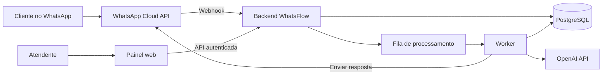

# WhatsFlow — Visão Geral da Documentação

## Índice

1. [Propósito desta documentação](#propósito-desta-documentação)
2. [Resumo executivo](#resumo-executivo)
3. [Princípios do produto](#princípios-do-produto)
4. [Mapa dos documentos](#mapa-dos-documentos)
5. [Vocabulário comum](#vocabulário-comum)
6. [Premissas desta Sprint](#premissas-desta-sprint)
7. [Como usar esta documentação](#como-usar-esta-documentação)
8. [Recomendações do Arquiteto](#recomendações-do-arquiteto)

## Propósito desta documentação

Este diretório contém a base de produto e arquitetura do WhatsFlow para a Sprint 1 — Fundação. Seu objetivo é reduzir ambiguidades antes da implementação: definir o que será entregue, como os componentes colaborarão, quais decisões já foram tomadas e quais riscos precisam ser validados.

A Fase 1 desta Sprint foi exclusivamente documental. A Fase 2, solicitada posteriormente pelo responsável do projeto, prepara infraestrutura executável com React/Vite, Express, PostgreSQL e Prisma, sem regras de negócio ou integrações externas. A mudança de sequência e stack está registrada na ADR-007 de [decisions.md](decisions.md). Os fluxos de atendimento descritos aqui continuam sendo a arquitetura-alvo do MVP.

## Resumo executivo

O WhatsFlow será uma plataforma web de atendimento para pequenas empresas, integrada à WhatsApp Cloud API. No MVP, uma assistência técnica fictícia usará a plataforma para:

- receber mensagens enviadas por seus clientes;
- manter o histórico de contatos e conversas;
- responder perguntas frequentes e consultas simples de catálogo com apoio de IA;
- reconhecer situações que não devem ser automatizadas;
- transferir o atendimento para uma pessoa;
- acompanhar conversas em um painel administrativo básico.

A arquitetura inicial será um **monólito modular**, com frontend web, backend HTTP, processamento assíncrono de mensagens e banco de dados relacional. Integrações externas ficarão isoladas por adaptadores. Essa abordagem preserva fronteiras claras sem introduzir, no MVP, o custo operacional de microsserviços.

## Princípios do produto

As decisões das próximas Sprints devem respeitar os seguintes princípios, nesta ordem prática:

1. **Confiabilidade antes de automação:** nenhuma mensagem deve ser perdida porque a IA ou um provedor está indisponível.
2. **Humano sempre alcançável:** baixa confiança, risco ou solicitação explícita devem permitir escalonamento.
3. **IA como dependência, não como núcleo do domínio:** regras de conversa, catálogo e auditoria permanecem sob controle do WhatsFlow.
4. **Fonte confiável antes de geração livre:** respostas operacionais devem usar dados aprovados do catálogo e das perguntas frequentes.
5. **Privacidade por padrão:** armazenar somente o necessário, controlar acesso e definir retenção.
6. **Evolução incremental:** começar com um monólito modular e extrair serviços apenas diante de uma necessidade mensurável.
7. **Operabilidade:** eventos relevantes devem ser rastreáveis por identificadores de correlação, métricas e logs sem conteúdo sensível desnecessário.

## Mapa dos documentos

Para preparar e validar o ambiente atual, consulte o [guia de infraestrutura da Fase 2](infrastructure.md) e o [README de desenvolvimento](../README.md).

| Documento                          | Pergunta que responde                               | Público principal                        |
| ---------------------------------- | --------------------------------------------------- | ---------------------------------------- |
| [scope.md](scope.md)               | O que o MVP entrega e o que não entrega?            | Produto, desenvolvimento e stakeholders  |
| [architecture.md](architecture.md) | Como o sistema será dividido e integrado?           | Desenvolvimento, arquitetura e operações |
| [user-flow.md](user-flow.md)       | O que ocorre com uma mensagem, inclusive em falhas? | Produto, QA e desenvolvimento            |
| [decisions.md](decisions.md)       | Por que as decisões estruturais foram tomadas?      | Desenvolvimento e arquitetura            |
| [roadmap.md](roadmap.md)           | Em que ordem o produto será construído?             | Produto e equipe técnica                 |

## Vocabulário comum

| Termo                    | Significado neste projeto                                                     |
| ------------------------ | ----------------------------------------------------------------------------- |
| Cliente                  | Pessoa que conversa com a assistência técnica pelo WhatsApp.                  |
| Atendente                | Usuário interno que consulta ou assume conversas no painel.                   |
| Conversa                 | Agrupamento lógico das mensagens de um cliente com a empresa.                 |
| Mensagem                 | Evento individual recebido ou enviado, com direção, conteúdo e estado.        |
| Atendimento automatizado | Período em que o sistema pode produzir respostas com IA.                      |
| Atendimento humano       | Estado em que a automação de respostas fica suspensa e um atendente assume.   |
| Escalonamento ou handoff | Transição controlada do atendimento automatizado para o humano.               |
| Catálogo                 | Fonte estruturada e aprovada de serviços oferecidos pela empresa.             |
| FAQ                      | Pergunta frequente com conteúdo de resposta previamente aprovado.             |
| Webhook                  | Chamada HTTP enviada pela Meta ao backend para notificar eventos.             |
| Idempotência             | Propriedade que impede um mesmo evento repetido de causar efeitos duplicados. |

## Premissas desta Sprint

- Haverá inicialmente uma única empresa fictícia, mas os limites de domínio não devem impedir futura multitenancy.
- O canal do MVP é somente WhatsApp Cloud API.
- O idioma inicial é português do Brasil.
- O painel é de uso interno e responsivo, sem compromisso de aplicativo móvel nativo.
- O catálogo é simples e informativo; preço final e diagnóstico técnico podem exigir confirmação humana.
- A IA não autoriza pagamento, não fecha orçamento vinculante e não executa ações irreversíveis.
- Texto é o tipo de mensagem plenamente automatizado no MVP. Outros tipos podem ser registrados e encaminhados, conforme detalhado no escopo.
- Provedor, modelo e parâmetros de IA serão configuráveis. A escolha final do modelo depende de avaliação de qualidade, latência e custo com um conjunto de conversas representativo.

## Como usar esta documentação

Antes de iniciar uma etapa de implementação:

1. confirme o escopo correspondente em `scope.md`;
2. localize o componente e seus limites em `architecture.md`;
3. valide o caminho feliz e as exceções em `user-flow.md`;
4. consulte as ADRs em `decisions.md` antes de alterar uma decisão estrutural;
5. atualize a documentação na mesma entrega quando um contrato ou decisão mudar.

Uma decisão considerada definitiva neste momento pode ser substituída. A substituição deve ocorrer por nova ADR, preservando o histórico e marcando a decisão anterior como substituída.

## Recomendações do Arquiteto

- Validar este vocabulário com alguém representando a operação da assistência antes da Sprint 2.
- Definir um responsável de produto para aprovar FAQ, catálogo, tom de voz e critérios de escalonamento.
- Tratar métricas, privacidade e atendimento humano como requisitos do MVP, não como acabamento posterior.
- Revisar estes documentos no encerramento de cada Sprint para evitar divergência entre arquitetura descrita e sistema real.
