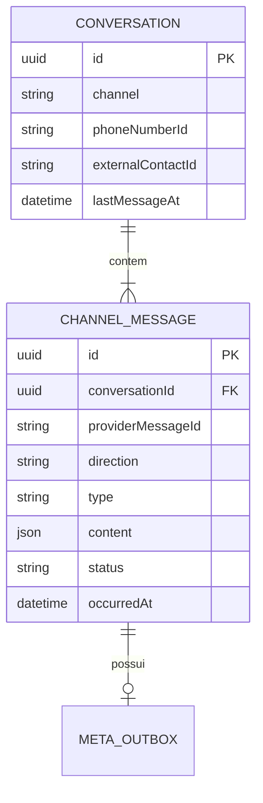

# Sprint 2 — Comunicação: relatório final

**Concluída em:** 2026-10-02. **Estado:** concluída após Fase 4 — Comunicação WhatsApp e Fase 5 — Persistência e Histórico.

A Sprint foi inicialmente encerrada após o aceite real da Fase 4 e reaberta porque o roadmap ainda previa a Fase 5. A reabertura não invalidou nem repetiu a prova ponta a ponta; acrescentou o modelo de conversas, histórico e sua regressão automatizada.

## Índice

1. [O que já existia antes da Fase 5](#1-o-que-já-existia-antes-da-fase-5)
2. [O que foi criado](#2-o-que-foi-criado)
3. [O que foi alterado](#3-o-que-foi-alterado)
4. [Schema final relevante](#4-schema-final-relevante)
5. [Migration criada](#5-migration-criada)
6. [Endpoints disponíveis](#6-endpoints-disponíveis)
7. [Testes executados](#7-testes-executados)
8. [Resultado do pnpm check](#8-resultado-do-pnpm-check)
9. [Regressões verificadas](#9-regressões-verificadas)
10. [Dívidas técnicas](#10-dívidas-técnicas)
11. [Status final da Sprint 2](#11-status-final-da-sprint-2)
12. [Próximo passo](#12-próximo-passo)
13. [Configurações externas e evidências reais](#13-configurações-externas-e-evidências-reais)
14. [Problemas encontrados](#14-problemas-encontrados)
15. [Como validar](#15-como-validar)
16. [Commits sugeridos](#16-commits-sugeridos)
17. [Recomendações do Arquiteto](#17-recomendações-do-arquiteto)

## 1. O que já existia antes da Fase 5

### Fase 4 — Comunicação WhatsApp

- Webhook GET de challenge e POST de eventos, controller separado do serviço.
- HMAC-SHA256 sobre o corpo bruto, comparação constante, limites de payload e validação de WABA/Phone Number ID.
- `MetaInbox` persistida antes do ACK e consumida por worker separado.
- `ChannelMessage` como mensagem técnica normalizada, sem duplicar o conceito na Fase 5.
- `MetaOutbox` transacional, reservas concorrentes com `SKIP LOCKED` e proteção contra retry cego.
- `MetaDelivery` e estados `accepted`, `sent`, `delivered`, `read`, `failed` e `uncertain`, sem inferir estados ausentes.
- Cliente HTTP Meta isolado, texto/template simples, timeout e classificação de falhas.
- CLI local de enqueue/status, sem endpoint público de envio nem resposta automática.
- Logs sanitizados, configuração opcional e testes HTTP/mockados/PostgreSQL.

O fluxo real WhatsApp → Meta → webhook → inbox → worker → outbox → Meta → telefone já havia sido validado. Essa evidência foi preservada.

## 2. O que foi criado

### Fase 5 — Persistência e Histórico

- Modelo `Conversation` genérico, sem referência à Atlas Tech.
- Relação obrigatória `Conversation 1:N ChannelMessage`.
- Campo `occurredAt` para ordenação temporal estável das mensagens.
- Identidade única da conversa por `(channel, phoneNumberId, externalContactId)`.
- Upsert atômico que impede duas conversas para o mesmo contato/canal sob concorrência.
- Atualização monotônica de `lastMessageAt`.
- Serviço e rotas REST para listagem, detalhe e histórico paginado.
- Cursor opaco com timestamp e UUID como desempate.
- Projeção de API que não retorna o payload bruto da Meta.
- ADR-011 documentando a identidade da conversa.
- Testes de integração de identidade, concorrência, vínculo, ordenação, paginação e endpoints.

Arquivos novos da Fase 5:

```text
apps/backend/prisma/migrations/20261002000000_conversations_history/migration.sql
apps/backend/src/http/api-error.ts
apps/backend/src/modules/conversations/conversation.routes.ts
apps/backend/src/modules/conversations/conversation.service.ts
```

## 3. O que foi alterado

Na Fase 5:

```text
README.md
apps/backend/prisma/schema.prisma
apps/backend/src/app.ts
apps/backend/src/http/error-handler.ts
apps/backend/src/integrations/meta/store.ts
apps/backend/src/server.ts
apps/backend/test/integration/meta-store.test.ts
docs/architecture.md
docs/decisions.md
docs/overview.md
docs/roadmap.md
docs/user-flow.md
docs/reviews/sprint-02-review.md
```

Os arquivos da Fase 4 permanecem descritos no histórico Git da entrega ainda não commitada. Nenhuma migration aplicada anteriormente foi editada e nenhum dado real foi apagado.

## 4. Schema final relevante



`ChannelMessage` continua responsável por direção, conteúdo técnico, identificador externo e estado de entrega. `Conversation` agrupa o histórico e não antecipa status de atendimento, handoff, usuário ou regras de negócio.

## 5. Migration criada

Migration: `20261002000000_conversations_history`.

Ela:

1. cria `Conversation`;
2. adiciona `conversationId` e `occurredAt` inicialmente opcionais;
3. agrupa mensagens existentes por número empresarial e contato;
4. cria as conversas e faz backfill dos vínculos/timestamps;
5. torna os campos obrigatórios;
6. cria chave única, índices e foreign key restritiva.

Resultado no banco real após aplicação: duas mensagens preservadas, uma conversa criada, zero mensagens sem vínculo, zero conversas duplicadas e zero divergências de última atividade. O Prisma encontrou três migrations aplicadas e `migrate diff` retornou `No difference detected`.

## 6. Endpoints disponíveis

| Método | Rota                              | Comportamento                                    |
| ------ | --------------------------------- | ------------------------------------------------ |
| GET    | `/api/conversations`              | Lista por atividade mais recente                 |
| GET    | `/api/conversations/:id`          | Retorna conversa e quantidade de mensagens       |
| GET    | `/api/conversations/:id/messages` | Histórico cronológico inbound/outbound e estados |

Listagem e histórico aceitam `limit` de 1 a 100 e `cursor` opaco. Respostas incluem `page.nextCursor`. IDs inválidos retornam 400; conversa inexistente retorna 404. O payload bruto não é exposto; mensagens textuais retornam somente o texto normalizado necessário.

Autenticação pertence à Sprint 4. Até lá, as rotas são base interna e não devem ser publicadas diretamente na internet.

## 7. Testes executados

| Verificação                    | Resultado                                        |
| ------------------------------ | ------------------------------------------------ |
| Testes unitários/HTTP/Meta     | 6 aprovados                                      |
| Integração com PostgreSQL real | 10 testes aprovados em schema temporário isolado |
| Primeira mensagem              | cria `Conversation`                              |
| Mesmo contato                  | reutiliza a conversa                             |
| Contatos diferentes            | criam conversas diferentes                       |
| Concorrência                   | não duplica conversa                             |
| Mensagem duplicada             | continua idempotente                             |
| Direções                       | inbound/outbound preservadas                     |
| Última atividade               | corresponde ao maior `occurredAt`                |
| API e paginação                | listagem, detalhe e histórico aprovados          |
| Delivery/status/outbox         | cenários anteriores continuam aprovados          |
| Migration PostgreSQL real      | aplicada com sucesso                             |
| Prisma migrate status          | banco atualizado                                 |
| Schema drift                   | nenhuma diferença detectada                      |

O HTTP Meta permaneceu mockado nos testes automatizados. Nenhuma mensagem real foi disparada durante a Fase 5.

## 8. Resultado do pnpm check

`pnpm check` foi aprovado integralmente após as alterações:

- Prettier;
- ESLint;
- TypeScript strict;
- testes unitários/HTTP/Meta;
- build backend;
- build frontend.

Também foram aprovados `prisma validate`, testes de integração PostgreSQL, `prisma migrate status`, verificação de drift e `git diff --check`.

## 9. Regressões verificadas

- challenge e assinatura do webhook;
- validação e deduplicação da inbox;
- ACK rápido sem IA ou processamento externo;
- normalização inbound;
- enqueue idempotente e atomicidade mensagem/outbox;
- reservas e recuperação de leases;
- worker e cliente Meta mockado;
- recibos adiantados e estados monotônicos;
- erro 130497 sem reenvio;
- timeout/crash em estado incerto;
- callback posterior reconciliando mensagem incerta;
- troca de Phone Number ID e rate limit.

A mudança acrescentou a conversa dentro das transações de normalização/enqueue, mas não alterou autenticação do webhook, contrato HTTP da Meta, política de retry ou envio. Por isso não foi necessário abrir novo túnel nem repetir o teste real.

## 10. Dívidas técnicas

- Política de retenção, expurgo e anonimização ainda não implementada.
- Endpoints de histórico aguardam autenticação/autorização da Sprint 4.
- Não há UI, métricas de fila, heartbeat ou reprocessamento administrativo.
- Não há estado complexo de conversa, fechamento/reabertura ou handoff.
- Uma WABA/número por execução; multitenancy não pertence ao MVP atual.
- Payload bruto da inbox exige retenção limitada antes de uso com clientes reais.
- Quick Tunnel era temporário e está encerrado; um deploy futuro precisa de HTTPS estável.
- DNS/egress do ambiente Docker deve ser corrigido antes de operação persistente.

## 11. Status final da Sprint 2

### Fase 4 — Comunicação WhatsApp

- [x] webhook público validado pela Meta;
- [x] assinatura real validada;
- [x] mensagem real recebida e persistida;
- [x] deduplicação comprovada;
- [x] worker e outbox processados;
- [x] mensagem enviada pelo WhatsFlow;
- [x] `sent` e `delivered` registrados;
- [x] recebimento físico no telefone confirmado.

### Fase 5 — Persistência e Histórico

- [x] `Conversation` modelada;
- [x] `ChannelMessage` relacionada à conversa;
- [x] inbound e outbound vinculados;
- [x] idempotência preservada;
- [x] concorrência sem conversas duplicadas;
- [x] histórico e paginação disponíveis;
- [x] estados de entrega preservados;
- [x] migration aplicada e sem drift;
- [x] testes e regressão aprovados;
- [x] documentação atualizada.

**Sprint 2 — Comunicação: CONCLUÍDA.**

O estado `read` não foi recebido no aceite real e não foi inferido. `delivered` mais a confirmação física atenderam ao gate de entrega.

## 12. Próximo passo

**Sprint 3 — Inteligência.** A próxima Sprint poderá consumir conversas e histórico para classificação e respostas fundamentadas. OpenAI, FAQ, catálogo, políticas de automação e handoff não foram implementados nesta entrega.

## 13. Configurações externas e evidências reais

O desenvolvedor concluiu app `WFlow Desenvolvimento`, WABA, credenciais/IDs, eSIM Claro e cadastro do número brasileiro. O `.env` privado permaneceu ignorado pelo Git. Um Cloudflare Quick Tunnel temporário publicou `/webhooks/meta`; callback/verify token foram aceitos, `messages` foi assinado e o app associado à WABA por `POST /{WABA-ID}/subscribed_apps`.

O teste real comprovou mensagem do telefone para o webhook, assinatura, persistência e worker. A resposta foi enfileirada pelo WhatsFlow, aceita pela Meta, recebeu `sent`/`delivered` e chegou fisicamente ao aparelho. Nenhum segredo, telefone, payload ou ID externo foi registrado neste relatório.

O erro 130497 do número de teste internacional +1 permanece somente como histórico/troubleshooting. Ele não representa falha atual do número brasileiro.

## 14. Problemas encontrados

1. Assinar `messages` não associou automaticamente o app à WABA; foi necessário `subscribed_apps`.
2. DNS do Docker não resolveu `graph.facebook.com`; estados incertos impediram retry cego e o aceite usou rota host-network temporária.
3. O build Docker ficou bloqueado por DNS ao Docker Hub; validações locais e com a imagem existente foram aprovadas.
4. O host não acessou PostgreSQL pela porta publicada neste ambiente; testes/migrations usaram a rede interna Docker.
5. Na Fase 5, o runtime padrão do agente oferecia pnpm 11; as validações usaram explicitamente Node 24/pnpm 10.34.5 exigidos pelo projeto.

Esses problemas estão separados de falhas da aplicação. Nenhum deles bloqueia a conclusão funcional da Sprint.

## 15. Como validar

Com Node 24 e pnpm 10.34.5:

```bash
pnpm install --frozen-lockfile
pnpm db:generate
pnpm db:validate
pnpm check
docker compose up -d --wait postgres
pnpm db:deploy
pnpm db:status
git diff --check
```

Os testes de integração exigem `TEST_DATABASE_URL` explícita. Neste ambiente, em que o host não alcançou a porta publicada do PostgreSQL, eles foram executados com segurança pela rede Compose:

```bash
docker compose run --rm --no-deps \
  -v "$PWD:/workspace" -w /workspace backend \
  sh -lc 'TEST_DATABASE_URL="$DATABASE_URL" pnpm test:integration'
```

Para inspecionar a API, inicie o backend e use uma conversa existente:

```bash
curl --fail 'http://localhost:3000/api/conversations?limit=20'
curl --fail 'http://localhost:3000/api/conversations/UUID'
curl --fail 'http://localhost:3000/api/conversations/UUID/messages?limit=20'
```

## 16. Commits sugeridos

Nenhum commit foi realizado.

```text
docs: reposition WhatsFlow with a decoupled demo company
feat(meta): integrate WhatsApp Cloud API with durable inbox and outbox
feat(conversations): add persisted conversations and paginated history
docs: complete Sprint 2 communication review
```

## 17. Recomendações do Arquiteto

- Definir retenção e supervisão antes de usar conversas de clientes reais.
- Adicionar autenticação antes de publicar os endpoints de histórico.
- Medir a fila PostgreSQL antes de reconsiderar Redis/BullMQ.
- Preservar separadamente evidências mockadas, de banco real e ponta a ponta do provedor.
- Resolver DNS/egress no ambiente de deploy sem transformar o workaround de aceite em arquitetura permanente.
