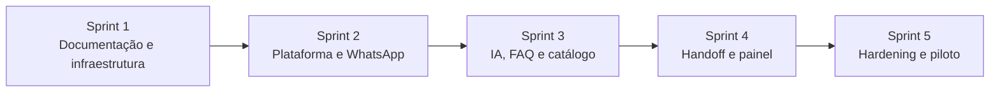
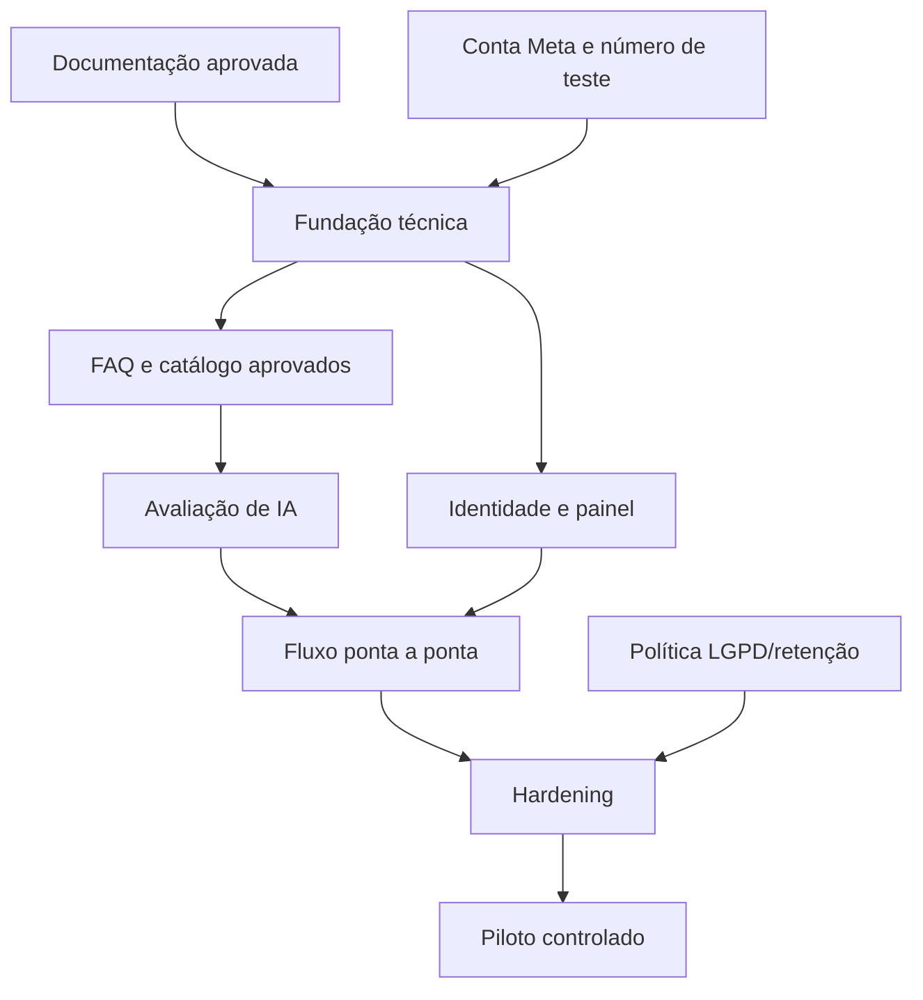

# Roadmap do WhatsFlow

## Índice

1. [Princípios do roadmap](#princípios-do-roadmap)
2. [Visão das Sprints](#visão-das-sprints)
3. [Sprint 1 — Fundação](#sprint-1--fundação)
4. [Sprint 2 — Plataforma e integração do canal](#sprint-2--plataforma-e-integração-do-canal)
5. [Sprint 3 — Automação inteligente](#sprint-3--automação-inteligente)
6. [Sprint 4 — Operação humana e painel](#sprint-4--operação-humana-e-painel)
7. [Sprint 5 — Qualidade e piloto](#sprint-5--qualidade-e-piloto)
8. [Dependências e gates](#dependências-e-gates)
9. [Recomendações do Arquiteto](#recomendações-do-arquiteto)

## Princípios do roadmap

- Uma Sprint só inicia após os critérios de saída da anterior.
- Cada Sprint entrega incremento verificável e documentação atualizada.
- Integrações externas são validadas cedo, mas regras críticas permanecem testáveis sem rede.
- Segurança, observabilidade e testes acompanham cada incremento.
- Funcionalidade futura não entra por conveniência técnica sem mudança de escopo aprovada.

Este roadmap descreve objetivos e gates, não datas. Estimativas dependem do tamanho da equipe, ambiente e acesso às contas externas.

## Visão das Sprints

| Sprint | Resultado principal                               | Prova de conclusão                                                         |
| ------ | ------------------------------------------------- | -------------------------------------------------------------------------- |
| 1      | Fase 1: documentação; Fase 2: infraestrutura      | Build, health, PostgreSQL, Prisma e Docker validados; sem regra de negócio |
| 2      | Mensagem recebida e persistida com confiabilidade | Teste de webhook/idempotência e observabilidade                            |
| 3      | Resposta automática fundamentada ou handoff       | Conjunto de avaliação e fallbacks aprovados                                |
| 4      | Atendente opera conversas pelo painel             | Fluxo ponta a ponta humano, autorizado e auditável                         |
| 5      | MVP seguro e operável em piloto                   | Gates de qualidade, restauração e operação satisfeitos                     |

## Sprint 1 — Fundação

### Objetivo

Eliminar ambiguidades na Fase 1 e preparar a infraestrutura na Fase 2, conforme solicitação posterior do responsável (ADR-007).

### Entregas

- visão geral e vocabulário;
- escopo, restrições e critérios de sucesso;
- arquitetura e limites dos componentes;
- fluxo completo e exceções;
- ADRs iniciais;
- roadmap de cinco Sprints.
- Fase 2: workspace, Express, React/Vite, TypeScript, ESLint/Prettier, Docker Compose, PostgreSQL, Prisma e migration inicial sem domínio.

### Critério de saída

- documentação consistente e revisável;
- recomendações claramente separadas do escopo aprovado;
- nenhuma implementação de regra de negócio;
- pendências técnicas registradas com momento de decisão.
- backend/frontend compilando e iniciando, banco acessível pelo Prisma e ambiente Compose validado.

## Sprint 2 — Plataforma e integração do canal

### Objetivo

Evoluir a fundação entregue na Sprint 1/Fase 2 para receber mensagens com segurança, sem depender da IA para completar o fluxo.

### Entregas previstas

- ampliar os módulos sobre o workspace e os ambientes locais da Fase 2;
- automatizar em CI os comandos de qualidade existentes e evoluir migrações e gestão de segredos;
- modelo inicial de contato, conversa, mensagem, evento e auditoria;
- webhook da WhatsApp Cloud API com verificação, normalização e idempotência;
- outbox, fila/worker e estratégia de retentativa;
- adaptador de envio com ambiente de teste;
- logs, métricas, health checks e correlação;
- decisão de hospedagem, identidade e tecnologia final de fila;
- testes unitários, integração e contrato do fluxo de admissão.

### Critério de saída

- evento válido é persistido uma vez mesmo se reenviado;
- ACK não depende de processamento lento;
- job pode ser reexecutado sem duplicar efeito;
- falhas de banco/fila são observáveis e recuperáveis conforme desenho;
- nenhuma credencial aparece no repositório ou logs.

## Sprint 3 — Automação inteligente

### Objetivo

Responder com segurança às intenções aprovadas e escalar o restante.

### Entregas previstas

- módulo Knowledge com FAQ e catálogo versionáveis;
- política determinística de elegibilidade e escalonamento;
- porta de IA e adaptador OpenAI Responses API;
- esquema de saída estruturada e validação;
- prompts/políticas versionados;
- respostas fundamentadas e fallbacks;
- registro de attempts, latência, uso e resultado;
- conjunto de avaliação com casos felizes, adversariais e fora do escopo;
- limites de custo, timeout e retentativa.

### Critério de saída

- cenários aprovados de FAQ/catálogo atingem meta de qualidade definida;
- saída inválida, recusa e indisponibilidade não chegam ao cliente como conteúdo bruto;
- pergunta sem base não gera fato inventado;
- modelo pode ser substituído/configurado sem alterar o domínio;
- solicitação humana suspende automação.

## Sprint 4 — Operação humana e painel

### Objetivo

Permitir que usuários internos controlem conteúdo e assumam conversas com segurança.

### Entregas previstas

- autenticação e autorização por papéis;
- lista/filtro de conversas e fila de handoff;
- detalhe com histórico cronológico e estados;
- assumir, responder, encerrar e devolver à automação;
- tratamento de concorrência entre atendente e worker;
- manutenção básica de FAQ e catálogo;
- indicadores operacionais essenciais;
- acessibilidade, responsividade e estados de erro;
- auditoria de ações administrativas.

### Critério de saída

- usuários sem permissão não executam ações protegidas;
- dois atendentes não assumem silenciosamente a mesma conversa;
- automação não responde durante modo humano;
- resposta humana é rastreável e usa o mesmo pipeline confiável de envio;
- tarefas essenciais passam em teste de usabilidade com representante da operação.

## Sprint 5 — Qualidade e piloto

### Objetivo

Preparar o MVP para uso controlado com dados reais e operação sustentável.

### Entregas previstas

- revisão de segurança e threat model;
- validação LGPD, retenção, anonimização e acesso;
- testes de carga, caos/falha e condições de corrida;
- dashboards e alertas acionáveis;
- backup e restauração testados;
- runbooks de incidentes, credenciais e provedores;
- avaliação final de IA e revisão humana amostral;
- política de rollout, feature flags/kill switch da automação e rollback;
- treinamento curto de atendentes;
- piloto controlado e relatório de resultados.

### Critério de saída

- zero falha crítica conhecida sem mitigação aprovada;
- restauração demonstrada;
- automação pode ser desativada sem perder o canal humano;
- métricas de sucesso estão coletadas;
- responsáveis e procedimento de incidente estão definidos;
- decisão de seguir, ajustar ou interromper o piloto registrada.

## Dependências e gates

### Gates que bloqueiam avanço

- acesso indisponível à conta de desenvolvimento da Meta bloqueia validação real do canal, mas não testes por contrato;
- ausência de conteúdo aprovado bloqueia avaliação de respostas, não a construção da porta de IA;
- política de retenção indefinida bloqueia uso de dados reais, não desenvolvimento com dados sintéticos;
- falhas em idempotência, autorização ou handoff bloqueiam piloto;
- ausência de runbook e kill switch bloqueia automação com clientes reais.

## Recomendações do Arquiteto

- Planejar cada Sprint em etapas menores com demonstração ao final, mantendo estes gates como critérios de saída.
- Obter conta Meta, número de teste e conteúdo sintético antes da Sprint 2 para reduzir dependências externas.
- Não usar conversas reais em desenvolvimento; criar dataset sanitizado/sintético para testes e avaliação.
- Fazer o piloto com volume limitado e horário coberto por atendentes, ampliando apenas após evidência positiva.
- Recalibrar o roadmap após a prova do webhook e a primeira avaliação de IA, pois esses pontos concentram maior incerteza.
