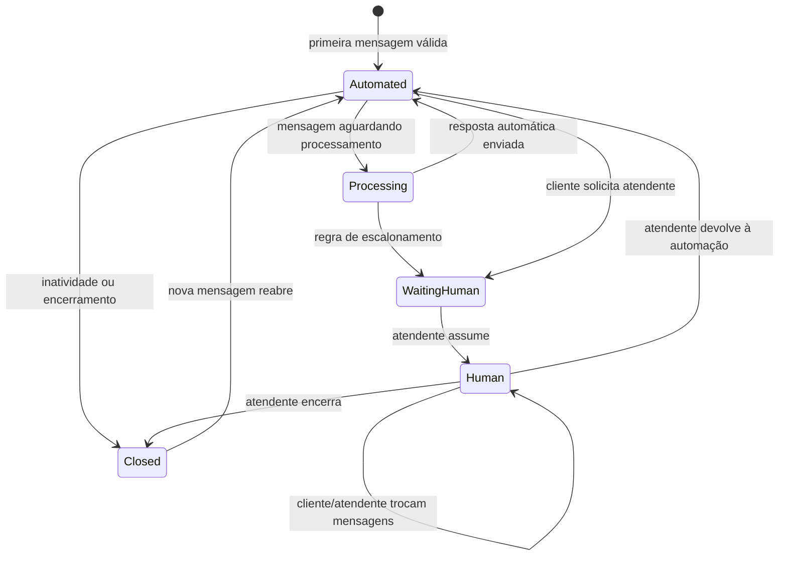
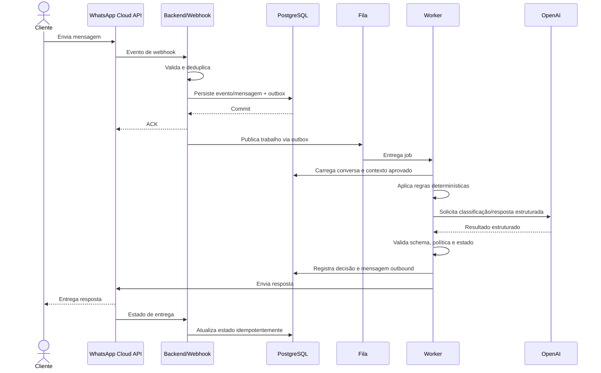

# Fluxo do Usuário e da Conversa

## Índice

1. [Atores e estados](#atores-e-estados)
2. [Jornada principal](#jornada-principal)
3. [Detalhamento etapa a etapa](#detalhamento-etapa-a-etapa)
4. [Escalonamento para humano](#escalonamento-para-humano)
5. [Jornada do atendente](#jornada-do-atendente)
6. [Exceções e fallbacks](#exceções-e-fallbacks)
7. [Regras de concorrência](#regras-de-concorrência)
8. [Cenários de aceite](#cenários-de-aceite)
9. [Recomendações do Arquiteto](#recomendações-do-arquiteto)

Este documento descreve o fluxo-alvo do MVP. Na Sprint 1, Fase 2, nenhum dos fluxos de atendimento é implementado; apenas a infraestrutura de execução e health checks será disponibilizada, conforme ADR-007.

## Atores e estados

### Atores

- **Cliente:** envia e recebe mensagens pelo WhatsApp.
- **Meta:** transporta mensagens e notificações.
- **Backend:** admite eventos, mantém estado e aplica regras.
- **Worker:** executa classificação, IA e envios assíncronos.
- **OpenAI:** produz interpretação/resposta sob contrato controlado.
- **Atendente:** assume casos que exigem ação humana.
- **Administrador:** mantém conteúdo aprovado e usuários.

### Estados conceituais da conversa

Os nomes finais podem mudar no modelo, mas as transições devem permanecer explícitas e auditáveis. “Processing” pode ser derivado de jobs pendentes, não necessariamente persistido como estado principal.

## Jornada principal

## Detalhamento etapa a etapa

### 1. Cliente envia a mensagem

O cliente inicia ou continua uma conversa no número oficial da TechCare. A experiência deve deixar claro que há automação e que atendimento humano pode ser solicitado.

**Responsável:** cliente e WhatsApp.

**Exceções:** formato não suportado, mensagem vazia, conteúdo muito extenso ou evento que não representa mensagem do cliente.

### 2. Meta envia o webhook

A WhatsApp Cloud API notifica o endpoint público do WhatsFlow. O evento pode ser entregue mais de uma vez ou conter notificações de estado além de mensagens.

**Responsável:** adaptador de webhook.

**Ações:** validar método, tamanho, autenticidade conforme contrato vigente, formato mínimo e tipo de evento. Gerar correlação sem registrar segredo ou payload sensível indiscriminadamente.

**Exceções:** assinatura inválida, evento desconhecido, versão incompatível, duplicidade e indisponibilidade do banco.

### 3. Admissão e persistência

O backend normaliza o evento, usa o ID externo como parte da chave idempotente e grava evento, contato/conversa/mensagem e outbox na mesma transação. Só então confirma o webhook.

**Responsável:** módulos Webhooks, Messaging e Conversations.

**Resultado:** mensagem aceita para processamento ou duplicidade reconhecida sem novo efeito.

**Exceções:** conflito de integridade, dado obrigatório ausente ou falha transacional. Em falha de persistência, o sistema não deve fingir sucesso.

### 4. Publicação e consumo assíncronos

O publicador da outbox entrega o trabalho à fila. O worker o reserva e impede processamento concorrente incompatível da mesma conversa.

**Responsável:** infraestrutura de outbox/fila e worker.

**Exceções:** fila indisponível, job expirado, múltiplas mensagens em rápida sequência e job reentregue.

Mensagens sucessivas podem ser processadas individualmente e em ordem ou agrupadas por uma pequena janela configurável. O MVP deve começar preservando ordem; agrupamento só deve ser adotado após teste de experiência.

### 5. Carregamento do contexto

O worker carrega apenas o necessário:

- estado e modo atual da conversa;
- mensagens recentes ou resumo controlado;
- FAQ e serviços ativos relevantes;
- políticas de tom, limites e escalonamento;
- horário e informações aprovadas da empresa.

**Responsável:** Automation com Knowledge e Conversations.

**Exceções:** conversa já assumida por humano, conteúdo administrativo inconsistente ou contexto acima do limite. Se o modo mudou para humano, a automação é cancelada antes de gerar/enviar resposta.

### 6. Classificação

Primeiro, regras determinísticas tratam casos inequívocos, como pedido explícito de atendente ou tipo não suportado. Para os demais, a IA devolve uma classificação limitada por esquema.

Intenções iniciais sugeridas:

- `greeting` — saudação/início;
- `faq` — horário, endereço, processo e políticas aprovadas;
- `service_catalog` — consulta de serviço suportado;
- `service_diagnosis_request` — tentativa de diagnóstico;
- `quote_or_deadline` — preço/prazo que pode exigir confirmação;
- `human_request` — pedido explícito de pessoa;
- `complaint_or_sensitive` — reclamação, risco ou caso sensível;
- `unsupported` — fora do escopo;
- `uncertain` — entendimento insuficiente.

**Responsável:** política da aplicação, apoiada pela IA.

**Exceções:** timeout, recusa, resposta incompleta, schema inválido ou classificação sem evidência. Todas levam a retry limitado ou caminho seguro, nunca ao envio direto de saída não validada.

### 7. Decisão: responder ou escalar

A aplicação avalia a classificação, estado e regras. A “confiança” declarada pelo modelo é apenas um sinal, não uma probabilidade calibrada. Regras determinísticas prevalecem.

**Responder automaticamente quando:** a intenção é suportada, existe conteúdo aprovado suficiente, a conversa permanece automática e não há indicador de risco.

**Escalar quando:** o cliente pede humano, falta conteúdo confiável, há risco/reclamação, repetição sem solução, tipo não suportado relevante ou falha persistente.

### 8. Geração e validação da resposta

A resposta deve ser curta, útil, em português do Brasil e baseada no contexto aprovado. Ela não pode prometer diagnóstico, preço final ou prazo não fornecido por regra confiável.

Antes do envio, o backend valida:

- conformidade da saída com o esquema;
- tamanho e presença de conteúdo;
- estado atual da conversa;
- ausência de ação proibida;
- referência a dados ativos e permitidos;
- possível moderação conforme política definida.

**Exceções:** conteúdo inválido, mudança de estado durante a geração, saída sem fundamento ou limite de custo/latência excedido. Nesses casos, descartar a saída e usar fallback/escalonamento.

### 9. Registro e envio

O sistema cria a mensagem outbound antes de chamar a Meta, com status inicial e vínculo à mensagem inbound. O envio usa chave/controle interno de idempotência. A resposta só é marcada como enviada após confirmação adequada do provedor.

**Responsável:** Messaging e adaptador da Meta.

**Exceções:** credencial inválida, rate limit, indisponibilidade, janela/política de envio ou erro permanente no destinatário. Erros transitórios têm retentativa limitada; permanentes ficam visíveis para operação.

### 10. Atualização de entrega

Webhooks posteriores podem indicar envio, entrega, leitura ou falha. O sistema atualiza o estado sem permitir regressão causada por notificações fora de ordem.

**Responsável:** Webhooks e Messaging.

## Escalonamento para humano

### Gatilhos mínimos

- texto equivalente a “quero falar com uma pessoa”;
- reclamação, ameaça, risco físico ou tema sensível;
- pedido de diagnóstico definitivo, negociação ou exceção de política;
- pergunta não coberta por catálogo/FAQ;
- duas tentativas automatizadas sem progresso, inicialmente configurável;
- falha persistente da IA ou do canal;
- conteúdo não textual que exija interpretação no MVP;
- ação manual de um atendente/administrador.

### Processo

1. registrar motivo, origem e data do escalonamento;
2. mudar a conversa para `WaitingHuman` atomicamente;
3. invalidar jobs automáticos ainda não iniciados ou fazê-los revalidar o estado;
4. enviar confirmação neutra ao cliente quando o canal permitir;
5. exibir a conversa na fila humana com histórico e motivo;
6. medir tempo de espera;
7. quando um atendente assumir, registrar responsável e auditoria;
8. manter automação silenciosa até ação explícita de devolver/encerrar.

Se não houver atendente disponível, o sistema não deve prometer um prazo inexistente. Pode informar horário de atendimento configurado e que a solicitação ficou registrada.

## Jornada do atendente

1. o atendente se autentica;
2. visualiza conversas aguardando humano, ordenadas por regra operacional definida;
3. abre uma conversa e consulta mensagens e motivo do handoff;
4. assume a conversa, evitando conflito de propriedade;
5. envia mensagens, que passam pelo backend, auditoria e fila de envio;
6. pode corrigir conteúdo administrativo por fluxo autorizado, sem alterar retroativamente o histórico;
7. encerra a conversa ou a devolve à automação de modo explícito;
8. o sistema registra ator, horário e transição.

Dois atendentes não devem assumir silenciosamente a mesma conversa. A API aplica controle de concorrência e informa conflito à interface.

## Exceções e fallbacks

| Situação                         | Comportamento esperado                                                        | Visibilidade                  |
| -------------------------------- | ----------------------------------------------------------------------------- | ----------------------------- |
| Mensagem duplicada               | Confirmar sem reprocessar                                                     | Métrica de deduplicação       |
| Mensagem não textual             | Registrar metadados permitidos e escalar/fallback                             | Conversa na fila humana       |
| IA temporariamente indisponível  | Retentar com backoff; não perder mensagem                                     | Métrica e alerta por impacto  |
| IA retorna saída inválida        | Descartar; retry limitado ou escalar                                          | Processing attempt auditável  |
| Sem conteúdo aprovado            | Não inventar; pedir informação segura ou escalar                              | Motivo `knowledge_gap`        |
| Meta falha temporariamente       | Manter outbound pendente e retentar                                           | Estado de envio no painel     |
| Falha permanente de envio        | Parar retentativas e sinalizar operação                                       | Conversa/alerta acionável     |
| Banco indisponível no webhook    | Não admitir evento sem persistência                                           | Health/alerta crítico         |
| Fila indisponível                | Outbox preserva intenção até recuperação                                      | Idade da outbox               |
| Atendente assume durante geração | Worker revalida e não envia automação                                         | Auditoria de cancelamento     |
| Cliente envia várias mensagens   | Preservar ordem por conversa                                                  | Jobs correlacionados          |
| Conteúdo abusivo                 | Aplicar política, limitar resposta e escalar/bloquear conforme regra aprovada | Auditoria com acesso restrito |

### Mensagem de fallback

O texto exato será aprovado pelo produto. Deve reconhecer a solicitação sem atribuir culpa, evitar promessas e oferecer atendimento humano. Não deve revelar detalhes internos como “erro de modelo” ou “fila indisponível”.

## Regras de concorrência

- jobs da mesma conversa devem respeitar ordem lógica;
- todo job revalida o estado da conversa antes de produzir efeito externo;
- mudanças para modo humano têm precedência sobre resposta automática pendente;
- mensagens outbound usam estado persistido e chave interna para evitar duplo envio;
- atualização administrativa concorrente usa versionamento otimista ou condição equivalente;
- eventos de entrega são aplicados conforme uma ordem monotônica definida.

## Cenários de aceite

1. **FAQ conhecida:** cliente pergunta horário; sistema responde apenas com horário ativo cadastrado e registra toda a cadeia.
2. **Serviço conhecido:** cliente pergunta se há manutenção de notebook; resposta usa catálogo e não inventa preço.
3. **Pedido humano:** cliente solicita atendente; nenhuma resposta de IA é enviada depois da transição.
4. **Webhook repetido:** mesmo evento chega duas vezes; existe uma mensagem inbound e no máximo uma resposta.
5. **IA indisponível:** mensagem permanece registrada, ocorre retry limitado e o cliente recebe fallback ou handoff.
6. **Corrida com atendente:** atendente assume enquanto a IA processa; resposta automática é cancelada.
7. **Conteúdo não suportado:** áudio é registrado e direcionado ao fluxo definido, sem falsa transcrição.
8. **Pergunta sem base:** o sistema não cria informação e registra lacuna de conhecimento.
9. **Falha de envio:** mensagem outbound permanece rastreável e não é marcada como entregue.
10. **Acesso indevido:** usuário sem papel adequado não altera FAQ, catálogo ou estado protegido.

## Recomendações do Arquiteto

- Validar os gatilhos de handoff e o limite de tentativas com atendentes reais; ambos devem ser configuração, não constante espalhada.
- Criar um catálogo de mensagens de fallback versionado e aprovado pelo produto.
- Testar explicitamente condições de corrida, pois “atendente assume enquanto IA responde” é um risco maior que o caminho feliz.
- Mapear políticas atuais da Meta para mensagens dentro e fora da janela de atendimento antes de fechar os cenários de envio.
